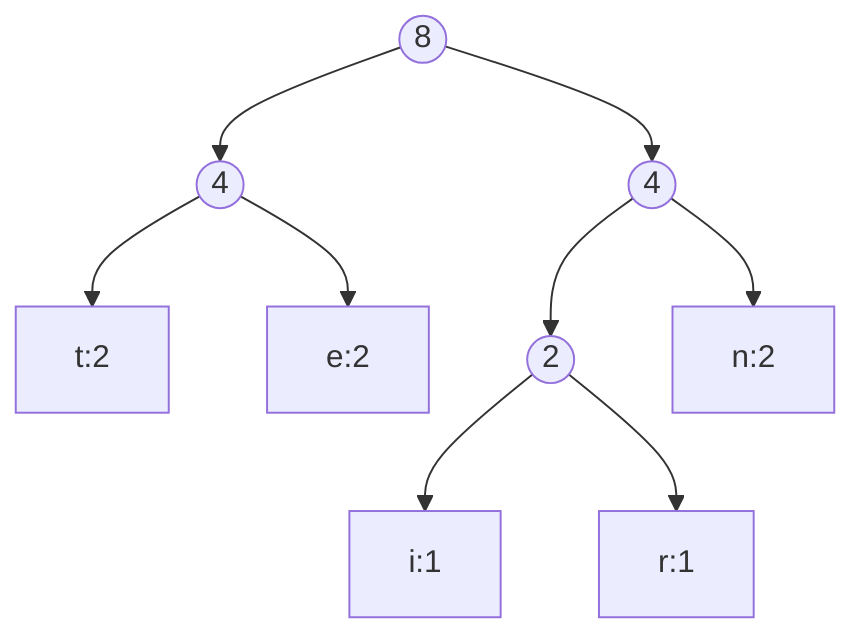

# Huffman Coding: An Overview

Huffman coding is a widely used **data compression algorithm**, recognized as a **Greedy Algorithm**. Its primary purpose is to reduce data size, similar to how formats like Zip, JPEG, PNG, and MP3 achieve compression. The algorithm constructs "minimum-redundancy codes" to minimize the average coding length per message.

[

---
## Core Properties and Principles

The design of Huffman codes adheres to specific properties:

- **Unique Codes:** No code can be used for more than one character.
- **Prefix-Free:** No code can be a prefix of another code. This property is crucial for unambiguous decoding.
- **Variable Length:** Longer codes are typically assigned to characters that appear least frequently, while shorter codes are assigned to more frequent characters. This is key to achieving compression.
[
---
## The Huffman Coding Algorithm Steps

The implementation of Huffman coding involves several key steps, as seen in the provided C++ code and illustrated conceptually in the slides.

### 1. Counting Character Frequencies

The first step is to **determine the frequency of each character** in the input string.

- In the C++ code [[5.4.2- Huffman Coding - Code#✅ The overall code]], the `count_strFreq` function takes an input string and populates an `unordered_map<char, int>` with character frequencies.
- For example, in the string "internet", the frequencies are: 'e': 2, 't': 2, 'n': 2, 'r': 1, 'i': 1.

[
### 2. Building the Priority Queue

After counting frequencies, a **priority queue** is used to store nodes, which represent characters and their frequencies.

- A `Node` struct is defined with a character (`ch`), its frequency (`freq`), and pointers to left and right children.
- The C++ implementation uses `std::priority_queue<Node *, vector<Node*>, Compare>`, which functions as a **min-heap**. The `Compare` struct ensures that nodes with the smallest frequencies have the highest priority (meaning they are at the top of the queue).
- Each unique character from the input string is inserted into this priority queue as a `Node`.
### 3. Creating the Huffman Tree

The Huffman tree is constructed iteratively by combining the nodes with the lowest frequencies. This is the "Greedy" part of the algorithm.

[

- The `create_huffmanTree` function in the C++ code repeatedly performs these actions until only one node remains in the priority queue:
    1. **Extract Two Minimums:** Take the two nodes with the lowest frequencies from the priority queue (the `left` and `right` children).
    2. **Create a New Parent Node:** Create a new internal `Node` (`merged`) whose frequency is the sum of the frequencies of the two extracted nodes. The character for this internal node is typically null (`\0`) as it doesn't represent an actual character from the input.
    3. **Assign Children:** Set the extracted `left` and `right` nodes as children of the new `merged` node.
    4. **Insert Merged Node:** Add this new `merged` node back into the priority queue.
- This process visually builds a binary tree where leaf nodes are the original characters and internal nodes represent combined frequencies. For instance, starting with 'i' (1) and 'r' (1), they combine to form a new node with frequency 2. This new node is then combined with other characters or combined nodes, eventually forming a single root node. The tree structure is a **binary tree**, specifically a **complete binary tree** when represented as a heap.

[

[

[

[

### Breakdown:
1. **Character frequencies** in "internet":
   - t:2, e:2, n:2, i:1, r:1 (total = 8)

### 4. Generating Huffman Codes

Once the Huffman tree is built, the binary codes for each character are generated by traversing the tree from the root to each leaf node.

[

- The `generate_HuffmanCodes` function uses a recursive approach.
- When traversing:
    - Moving to a **left child** appends '0' to the current code.
    - Moving to a **right child** appends '1' to the current code.
- When a **leaf node** is reached (meaning `root->left == nullptr && root->right == nullptr`), the accumulated code string is assigned to that character in an `unordered_map<char, string>` (e.g., `huffmanCode[root->ch] = code;`).
- For the "internet" example, the generated codes could be: 'e': 01, 't': 00, 'n': 11, 'r': 101, 'i': 100. Note that different valid Huffman trees can lead to different codes for the same characters, but the overall bit length of the compressed string will be the same.

[

[

[

### 5. Encoding the String

Finally, the original input string is encoded by replacing each character with its newly generated Huffman code.

- The `concat_encodedStr` function iterates through the input string and appends the corresponding Huffman code for each character to an `encodedStr`.
- For "internet":
    - Original (using 8-bit ASCII for simplicity): `01101001 01101110 01101000 01100101 01101110 01100101 01100010` (64 bits).
    - Compressed: `100 11 00 01 101 11 01 00` (18 bits).
    - This demonstrates significant data compression, where "internet" goes from 64 bits to 18 bits, plus the overhead of storing the Huffman map (which for "internet" makes the total 78 bits, but this overhead is amortized over longer texts).

[

---
## Data Structures in Detail

The Huffman coding algorithm relies heavily on specific data structures:

- **`Node` Struct:** Represents a node in the Huffman tree. It holds a character (`ch`), its frequency (`freq`), and pointers to its `left` and `right` children.

[

[

[

- **`std::unordered_map`:** Used to efficiently store character frequencies (`umFreq`) and the final Huffman codes (`umHuffCode`).
- **`std::priority_queue`:** Essential for building the Huffman tree by always retrieving the two nodes with the smallest frequencies.
    - It's an **abstract data type** where each element has a "priority".
    - Elements with higher priority are served before elements with lower priority.
    - A priority queue is typically implemented using a **heap** data structure, which can be a **Min-Heap** (smallest element has highest priority) or a **Max-Heap** (largest element has highest priority).
    - For Huffman coding, a **Min-Heap** is used because we want to extract the least frequent characters first.
    
[

[

[

[

[

- **Binary Tree:** The Huffman tree itself is a binary tree. It's a collection of related nodes, where each node has data and references to other nodes (children).

[

[

[

---
## Huffman Coding Variants

While the basic Huffman algorithm is powerful, several variants exist to address specific needs or improve performance in certain scenarios:

- **n-ary Huffman:** Uses n-ary trees instead of binary trees.
- **Adaptive Huffman:** Updates the Huffman tree dynamically as new characters are processed.
- **Length-limited Huffman:** Ensures that code lengths do not exceed a certain maximum.
- **Canonical Huffman:** Creates unique Huffman codes for a given set of frequencies, simplifying storage and transmission of the code map.
- **Hu-Tucker Coding:** A variant for optimal alphabetic codes.

[

---
## Analogy

Think of Huffman coding like a **custom postal service for your messages**. Instead of using standard-sized envelopes for every letter, regardless of how short or long, Huffman coding creates special, perfectly-sized envelopes for each type of letter you send. Very common letters (high frequency characters) get tiny, quick-to-deliver envelopes, while rare letters (low frequency characters) might get slightly larger ones. This way, the entire package of your messages becomes as compact and efficient to send as possible, saving space and time.

---

