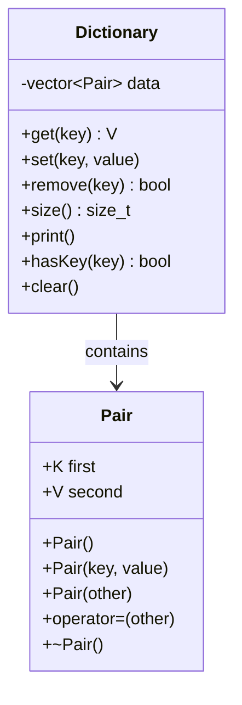

# Dictionary with Custom Pair Implementation

## Overview

This project implements a generic dictionary data structure in C++ using a custom Pair class. The dictionary stores key-value pairs in a vector and provides basic operations like get, set, remove, and print.

## Key Concepts

### Custom Pair Class

- **Template-based**: Works with any data types `Pair<K, V>`
- **Public members**: Direct access to `first` (key) and `second` (value)
- **Full constructor set**: Default, parameterized, and copy constructors
- **Memory management**: Proper assignment operator and destructor

### Dictionary Class

- **Storage**: Uses `vector<Pair<K, V>>` as underlying data structure
- **Search method**: Linear search (O(n) complexity)
- **Template design**: Generic implementation for any key-value types
- **Exception handling**: Throws `runtime_error` for missing keys

## Class Structure



## Core Methods

|Method|Description|Time Complexity|
|---|---|---|
|`get(key)`|Returns value for given key|O(n)|
|`set(key, value)`|Adds or updates key-value pair|O(n)|
|`remove(key)`|Removes key-value pair|O(n)|
|`size()`|Returns number of pairs|O(1)|
|`print()`|Displays all pairs|O(n)|
|`hasKey(key)`|Checks if key exists|O(n)|
|`clear()`|Removes all pairs|O(1)|

## Usage Examples

### Basic Operations

```cpp
Dictionary<string, int> dict;

// Adding items
dict.set("apple", 5);
dict.set("banana", 3);

// Getting values
int apples = dict.get("apple");  // Returns 5

// Checking existence
if (dict.hasKey("banana")) {
    cout << "Banana found!";
}

// Removing items
dict.remove("banana");
```

### Different Type Combinations

```cpp
// String to Integer
Dictionary<string, int> fruits;
fruits.set("apple", 5);

// Integer to String
Dictionary<int, string> numbers;
numbers.set(1, "one");

// String to String
Dictionary<string, string> translations;
translations.set("hello", "hola");
```

## Advantages & Disadvantages

### ✅ Advantages

- **Simple implementation**: Easy to understand and modify
- **Generic design**: Works with any data types
- **Memory efficient**: No hash table overhead
- **Predictable behavior**: Linear search is consistent

### ❌ Disadvantages

- **Poor performance**: O(n) for most operations
- **Not suitable for large datasets**: Performance degrades with size
- **No ordering**: Items stored in insertion order only

## Implementation Notes

### Memory Management

- Custom Pair class handles its own memory
- Vector automatically manages dynamic allocation
- Proper copy constructor and assignment operator prevent memory leaks

### Exception Handling

```cpp
try {
    int value = dict.get("nonexistent");
} catch (const runtime_error& e) {
    cout << "Key not found: " << e.what();
}
```

### Template Instantiation

The implementation includes explicit instantiation for common types:

- `Pair<int, int>`
- `Pair<string, int>`
- `Pair<int, string>`
- `Pair<string, string>`

## Performance Analysis

|Operation|Best Case|Average Case|Worst Case|
|---|---|---|---|
|Get|O(1)|O(n/2)|O(n)|
|Set (new)|O(1)|O(1)|O(1)|
|Set (update)|O(1)|O(n/2)|O(n)|
|Remove|O(1)|O(n/2)|O(n)|
|Size|O(1)|O(1)|O(1)|

## Alternative Improvements

### For Better Performance

1. **Hash Table**: Use hash-based storage for O(1) average operations
2. **Binary Search Tree**: Maintain sorted order for O(log n) operations
3. **Sorted Vector**: Use binary search for O(log n) lookup

### For More Features

1. **Iterators**: Add begin/end methods for range-based loops
2. **Operators**: Overload `[]` operator for easier access
3. **Const correctness**: More const methods and parameters

## Complete Code Implementation

### Dict-Pair.hpp

```cpp
/*
============================================================
* Project: Dictionary with Custom Pair Implementation
* File:    Dict-Pair.hpp
* Author:  [Ali El-bana]
* Date:    [2025-08-18]
* Version: [v1.0]
------------------------------------------------------------
* Description:
* Header file containing custom Pair class and Dictionary 
* class declarations for a generic dictionary data structure
* using a vector of custom pairs.
------------------------------------------------------------
* Notes:
* - Template-based implementation for generic types
* - Dictionary uses vector of Pair objects for storage
* - Linear search implementation (O(n) complexity)
============================================================
*/

#ifndef DICT_PAIR_HPP
#define DICT_PAIR_HPP

/* ====================== Includes ====================== */
#include <iostream>
#include <vector>
#include <stdexcept>

/* =================== Namespace Usage ================== */
using std::cout;
using std::endl;
using std::vector;
using std::runtime_error;

/* ====================== Declarations ================== */
// ▼▼▼ Class: Pair ▼▼▼
template<typename K, typename V>
class Pair;
// ▲▲▲ End of Pair ▲▲▲

// ▼▼▼ Class: Dictionary ▼▼▼
template<typename K, typename V>
class Dictionary;
// ▲▲▲ End of Dictionary ▲▲▲

/* ===================== Class Definitions =============== */
// ▼▼▼ Class: Pair ▼▼▼
template<typename K, typename V>
class Pair 
{
public:
    K first;
    V second;
    
    // Constructors
    Pair();
    Pair(const K& key, const V& value);
    
    // Copy constructor
    Pair(const Pair& other);
    
    // Assignment operator
    Pair& operator=(const Pair& other);
    
    // Destructor
    ~Pair();
};
// ▲▲▲ End of Pair ▲▲▲

// ▼▼▼ Class: Dictionary ▼▼▼
template<typename K, typename V>
class Dictionary 
{
private:
    vector<Pair<K, V>> data;

public:
    // Constructor
    Dictionary();
    
    // Destructor
    ~Dictionary();
    
    // Core methods
    V get(const K& key) const;
    void set(const K& key, const V& value);
    bool remove(const K& key);
    size_t size() const;
    void print() const;
    
    // Helper methods
    void clear();
};
// ▲▲▲ End of Dictionary ▲▲▲

#endif // DICT_PAIR_HPP

/* ======================= End of File =================== */
```

### Dict-Pair.cpp

```cpp
/*
============================================================
* Project: Dictionary with Custom Pair Implementation
* File:    Dict-Pair.cpp
* Author:  [Ali El-bana]
* Date:    [2025-08-18]
* Version: [v1.0]
------------------------------------------------------------
* Description:
* Implementation file for custom Pair class and Dictionary
* class methods. Contains all method definitions for both
* template classes.
------------------------------------------------------------
* Notes:
* - Template implementation included in source file
* - All methods are defined here due to template nature
* - Exception handling for invalid operations
============================================================
*/

/* ====================== Includes ====================== */
#include "Dict-Pair.hpp"

/* =================== Namespace Usage ================== */
using std::cout;
using std::endl;

/* ================== Function/Method Definitions =============== */

// ▼▼▼ Pair Class Implementation ▼▼▼

// ▼▼▼ Pair Default Constructor ▼▼▼
template<typename K, typename V>
Pair<K, V>::Pair() : first(K()), second(V()) 
{
    // Default initialization
}
// ▲▲▲ End of Pair Default Constructor ▲▲▲

// ▼▼▼ Pair Parameterized Constructor ▼▼▼
template<typename K, typename V>
Pair<K, V>::Pair(const K& key, const V& value) : first(key), second(value) 
{
    // Initialize with provided values
}
// ▲▲▲ End of Pair Parameterized Constructor ▲▲▲

// ▼▼▼ Pair Copy Constructor ▼▼▼
template<typename K, typename V>
Pair<K, V>::Pair(const Pair& other) : first(other.first), second(other.second) 
{
    // Copy constructor implementation
}
// ▲▲▲ End of Pair Copy Constructor ▲▲▲

// ▼▼▼ Pair Assignment Operator ▼▼▼
template<typename K, typename V>
Pair<K, V>& Pair<K, V>::operator=(const Pair& other) 
{
    if (this != &other) {
        first = other.first;
        second = other.second;
    }
    return *this;
}
// ▲▲▲ End of Pair Assignment Operator ▲▲▲

// ▼▼▼ Pair Destructor ▼▼▼
template<typename K, typename V>
Pair<K, V>::~Pair() 
{
    // Destructor implementation
}
// ▲▲▲ End of Pair Destructor ▲▲▲

// ▲▲▲ End of Pair Class Implementation ▲▲▲

// ▼▼▼ Dictionary Class Implementation ▼▼▼

// ▼▼▼ Dictionary Constructor ▼▼▼
template<typename K, typename V>
Dictionary<K, V>::Dictionary() 
{
    // Initialize empty dictionary
}
// ▲▲▲ End of Dictionary Constructor ▲▲▲

// ▼▼▼ Dictionary Destructor ▼▼▼
template<typename K, typename V>
Dictionary<K, V>::~Dictionary() 
{
    // Clear all data
    clear();
}
// ▲▲▲ End of Dictionary Destructor ▲▲▲

// ▼▼▼ Dictionary get Method ▼▼▼
template<typename K, typename V>
V Dictionary<K, V>::get(const K& key) const 
{
    for (const auto& pair : data) {
        if (pair.first == key) {
            return pair.second;
        }
    }
    throw runtime_error("Key not found");
}
// ▲▲▲ End of Dictionary get Method ▲▲▲

// ▼▼▼ Dictionary set Method ▼▼▼
template<typename K, typename V>
void Dictionary<K, V>::set(const K& key, const V& value) 
{
    // Check if key already exists and update
    for (auto& pair : data) {
        if (pair.first == key) {
            pair.second = value;
            return;
        }
    }
    // Key doesn't exist, add new pair
    data.push_back(Pair<K, V>(key, value));
}
// ▲▲▲ End of Dictionary set Method ▲▲▲

// ▼▼▼ Dictionary remove Method ▼▼▼
template<typename K, typename V>
bool Dictionary<K, V>::remove(const K& key) 
{
    for (auto it = data.begin(); it != data.end(); ++it) {
        if (it->first == key) {
            data.erase(it);
            return true;
        }
    }
    return false; // Key not found
}
// ▲▲▲ End of Dictionary remove Method ▲▲▲

// ▼▼▼ Dictionary size Method ▼▼▼
template<typename K, typename V>
size_t Dictionary<K, V>::size() const 
{
    return data.size();
}
// ▲▲▲ End of Dictionary size Method ▲▲▲

// ▼▼▼ Dictionary print Method ▼▼▼
template<typename K, typename V>
void Dictionary<K, V>::print() const 
{
    cout << "Dictionary contents:" << endl;
    for (const auto& pair : data) {
        cout << "  " << pair.first << " -> " << pair.second << endl;
    }
    if (data.empty()) {
        cout << "  (empty)" << endl;
    }
}
// ▲▲▲ End of Dictionary print Method ▲▲▲

// ▼▼▼ Dictionary clear Method ▼▼▼
template<typename K, typename V>
void Dictionary<K, V>::clear() 
{
    data.clear();
}
// ▲▲▲ End of Dictionary clear Method ▲▲▲

// ▲▲▲ End of Dictionary Class Implementation ▲▲▲

// Explicit template instantiation for common types
template class Pair<int, int>;
template class Pair<int, std::string>;
template class Pair<std::string, int>;
template class Pair<std::string, std::string>;

template class Dictionary<int, int>;
template class Dictionary<int, std::string>;
template class Dictionary<std::string, int>;
template class Dictionary<std::string, std::string>;

/* ======================= End of File =================== */
```

### main.cpp

```cpp
/*
============================================================
* Project: Dictionary with Custom Pair Implementation
* File:    main.cpp
* Author:  [Ali El-bana]
* Date:    [2025-08-18]
* Version: [v1.0]
------------------------------------------------------------
* Description:
* Main application file demonstrating the usage of custom
* Dictionary class with Pair implementation. Shows various
* operations including set, get, remove, and print.
------------------------------------------------------------
* Notes:
* - Demonstrates usage with different data types
* - Includes error handling examples
* - Shows both successful and failed operations
============================================================
*/

/* ====================== Includes ====================== */
#include <iostream>
#include <string>
#include "Dict-Pair.hpp"

/* =================== Namespace Usage ================== */
using std::cout;
using std::cin;
using std::endl;
using std::string;
using std::exception;

/* =================== Global Constants ================= */
// const int MAX_SIZE = 100;

/* ==================== Function Prototypes ============== */
// ▼▼▼ Function: demonstrateStringIntDict ▼▼▼
void demonstrateStringIntDict();
// ▲▲▲ End of demonstrateStringIntDict ▲▲▲

// ▼▼▼ Function: demonstrateIntStringDict ▼▼▼
void demonstrateIntStringDict();
// ▲▲▲ End of demonstrateIntStringDict ▲▲▲

// ▼▼▼ Function: demonstratePairFunctionality ▼▼▼
void demonstratePairFunctionality();
// ▲▲▲ End of demonstratePairFunctionality ▲▲▲

/* ==================== Main Application ================= */
int main(void) 
{
    // ----- Initialization -----
    system("cls");
    cout << "=== Dictionary with Custom Pair Implementation ===" << endl;
    cout << "Program started..." << endl << endl;
    
    // ----- Logic -----
    
    // Demonstrate Pair functionality
    cout << "=== Testing Custom Pair Class ===" << endl;
    demonstratePairFunctionality();
    cout << endl;
    
    // Demonstrate Dictionary with string keys and int values
    cout << "=== Testing Dictionary<string, int> ===" << endl;
    demonstrateStringIntDict();
    cout << endl;
    
    // Demonstrate Dictionary with int keys and string values
    cout << "=== Testing Dictionary<int, string> ===" << endl;
    demonstrateIntStringDict();
    cout << endl;

    // ----- End -----
    cout << "Program completed successfully!" << endl;
    return 0;
}

/* ================== Function/Method Definitions =============== */

// ▼▼▼ demonstratePairFunctionality Definition ▼▼▼
void demonstratePairFunctionality() 
{
    cout << "Creating pairs and testing functionality:" << endl;
    
    // Create different types of pairs
    Pair<string, int> pair1("apple", 5);
    Pair<int, string> pair2(42, "answer");
    Pair<string, int> pair3;  // Default constructor
    
    cout << "Pair 1: " << pair1.first << " -> " << pair1.second << endl;
    cout << "Pair 2: " << pair2.first << " -> " << pair2.second << endl;
    cout << "Pair 3 (default): " << pair3.first << " -> " << pair3.second << endl;
    
    // Test copy constructor
    Pair<string, int> pair4(pair1);
    cout << "Pair 4 (copy of pair1): " << pair4.first << " -> " << pair4.second << endl;
    
    // Test assignment operator
    pair3 = pair1;
    cout << "Pair 3 (after assignment): " << pair3.first << " -> " << pair3.second << endl;
}
// ▲▲▲ End of demonstratePairFunctionality ▲▲▲

// ▼▼▼ demonstrateStringIntDict Definition ▼▼▼
void demonstrateStringIntDict() 
{
    Dictionary<string, int> dict;
    
    // Add some key-value pairs
    cout << "Adding items to dictionary..." << endl;
    dict.set("apple", 5);
    dict.set("banana", 3);
    dict.set("orange", 8);
    dict.set("grape", 12);
    
    cout << "After adding items:" << endl;
    dict.print();
    cout << "Size: " << dict.size() << endl << endl;
    
    // Get values
    cout << "Getting values:" << endl;
    try {
        cout << "apple: " << dict.get("apple") << endl;
        cout << "banana: " << dict.get("banana") << endl;
        cout << "orange: " << dict.get("orange") << endl;
    } catch (const exception& e) {
        cout << "Error: " << e.what() << endl;
    }
    cout << endl;
    
    // Update existing key
    cout << "Updating apple from 5 to 10..." << endl;
    dict.set("apple", 10);
    dict.print();
    cout << endl;
    
    // Remove a key
    cout << "Removing banana..." << endl;
    if (dict.remove("banana")) {
        cout << "Successfully removed banana" << endl;
        dict.print();
        cout << "Size: " << dict.size() << endl;
    } else {
        cout << "Failed to remove banana" << endl;
    }
    cout << endl;
    
    // Try to get non-existent key
    cout << "Trying to get removed key 'banana':" << endl;
    try {
        cout << "banana: " << dict.get("banana") << endl;
    } catch (const exception& e) {
        cout << "Error: " << e.what() << endl;
    }
}
// ▲▲▲ End of demonstrateStringIntDict ▲▲▲

// ▼▼▼ demonstrateIntStringDict Definition ▼▼▼
void demonstrateIntStringDict() 
{
    Dictionary<int, string> numDict;
    
    // Add some number-word pairs
    cout << "Adding number-word pairs..." << endl;
    numDict.set(1, "one");
    numDict.set(2, "two");
    numDict.set(3, "three");
    numDict.set(4, "four");
    numDict.set(5, "five");
    
    numDict.print();
    cout << "Size: " << numDict.size() << endl << endl;
    
    // Get some values
    cout << "Getting values:" << endl;
    try {
        cout << "Key 2: " << numDict.get(2) << endl;
        cout << "Key 4: " << numDict.get(4) << endl;
        cout << "Key 1: " << numDict.get(1) << endl;
    } catch (const exception& e) {
        cout << "Error: " << e.what() << endl;
    }
    cout << endl;
    
    // Remove some keys
    cout << "Removing keys 2 and 4..." << endl;
    numDict.remove(2);
    numDict.remove(4);
    numDict.print();
    cout << "Size: " << numDict.size() << endl << endl;
    
    // Clear all
    cout << "Clearing all entries..." << endl;
    numDict.clear();
    numDict.print();
    cout << "Size: " << numDict.size() << endl;
}
// ▲▲▲ End of demonstrateIntStringDict ▲▲▲

/* ======================= End of File =================== */
```

## Tags

#cpp #data-structures #templates #dictionary #pair #algorithms #programming

---
